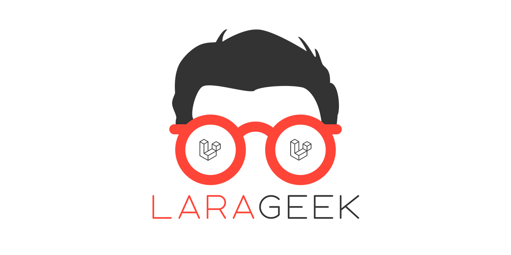

# LaraGeek Art

This repository contains all art related files for "LaraGeek".

## Colors

*  `#ff4538` **red**
  *  `#ff8d85` **light gradient**
  *  `#cc372d` **dark gradient**
*  `#333333` **gray**
*  `#ffffff` **white**

## Credits

* **Eyeglasses** [Freepik](https://www.flaticon.com/free-icon/eyeglasses_3721763)
* **Hair** [Freepik](https://www.flaticon.com/free-icon/male-short-hair-wig-shape_42270)
* **Font** [Aoki](https://elements.envato.com/de/aoki-typeface-2REATU)
* **Laravel** [Laravel Logo](https://github.com/laravel/art)
